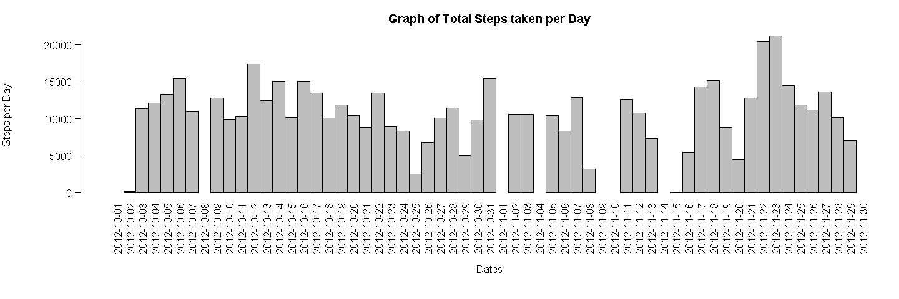

# Reproducible Research: Peer Assessment 1


## Loading and preprocessing the data

Load the data 

```r
originalData <- read.csv("activity.csv")
```

A portion of the original dataset

```
##    steps       date interval
## 1     NA 2012-10-01        0
## 2     NA 2012-10-01        5
## 3     NA 2012-10-01       10
## 4     NA 2012-10-01       15
## 5     NA 2012-10-01       20
## 6     NA 2012-10-01       25
## 7     NA 2012-10-01       30
## 8     NA 2012-10-01       35
## 9     NA 2012-10-01       40
## 10    NA 2012-10-01       45
## 11    NA 2012-10-01       50
## 12    NA 2012-10-01       55
## 13    NA 2012-10-01      100
## 14    NA 2012-10-01      105
## 15    NA 2012-10-01      110
## 16    NA 2012-10-01      115
## 17    NA 2012-10-01      120
## 18    NA 2012-10-01      125
## 19    NA 2012-10-01      130
## 20    NA 2012-10-01      135
```


## What is mean total number of steps taken per day?

1. A dataset containing the total number of steps taken each day is created.


```r
  dailyStepSum <- aggregate(originalData$steps, list(originalData$date), sum)
```
   A portion of the new dataset is as follows:
  
  ```
  ##          Date Steps
  ## 1  2012-10-01    NA
  ## 2  2012-10-02   126
  ## 3  2012-10-03 11352
  ## 4  2012-10-04 12116
  ## 5  2012-10-05 13294
  ## 6  2012-10-06 15420
  ## 7  2012-10-07 11015
  ## 8  2012-10-08    NA
  ## 9  2012-10-09 12811
  ## 10 2012-10-10  9900
  ## 11 2012-10-11 10304
  ## 12 2012-10-12 17382
  ## 13 2012-10-13 12426
  ## 14 2012-10-14 15098
  ## 15 2012-10-15 10139
  ## 16 2012-10-16 15084
  ## 17 2012-10-17 13452
  ## 18 2012-10-18 10056
  ## 19 2012-10-19 11829
  ## 20 2012-10-20 10395
  ```

2. A histogram of the above data is created as a form of visual representation.


```r
  with(dailyStepSum, {
      par(oma=c(2,0,0,0), mar=c(6.75,6.75,3,0), mgp=c(5.75,0.75,0), las=2)
      barplot(
        height=Steps,
        main="Graph of Total Steps taken per Day",
        xlab="Dates",
        ylab="Steps per Day",
        names.arg=Date,
        space=c(0)
      )
  })
```

 
3. Calculate the mean and median values (ignoring NA values) using the above dataset.

  1. Mean
    
    ```r
      dailyStepMean <- mean(dailyStepSum$Steps, na.rm=TRUE)
    ```
      
      ```
      ## [1] 10766.19
      ```
  2. Median
    
    ```r
      dailyStepMedian <- median(dailyStepSum$Steps, na.rm=TRUE)
    ```
    
    ```
    ## [1] 10765
    ```


## What is the average daily activity pattern?
1. Generate the mean (average) number of steps taken (ignoring NA values) for each 5-minute interval, itself averaged across all days.
  

```r
  intervalSteps <- aggregate(
      data=originalData,
      steps~interval,
      FUN=mean,
      na.action=na.omit
  )
  colnames(intervalSteps) <- c("Interval", "AvgStepsAvgAcrossDay")
```
   A portion of the new dataset is as follows:

```
##    Interval AvgStepsAvgAcrossDay
## 1         0            1.7169811
## 2         5            0.3396226
## 3        10            0.1320755
## 4        15            0.1509434
## 5        20            0.0754717
## 6        25            2.0943396
## 7        30            0.5283019
## 8        35            0.8679245
## 9        40            0.0000000
## 10       45            1.4716981
## 11       50            0.3018868
## 12       55            0.1320755
## 13      100            0.3207547
## 14      105            0.6792453
## 15      110            0.1509434
## 16      115            0.3396226
## 17      120            0.0000000
## 18      125            1.1132075
## 19      130            1.8301887
## 20      135            0.1698113
```
  
2. A Time-Series plot is created from the above datase


```r
  with(intervalSteps, {
      plot(
        x=Interval,
        y=AvgStepsAvgAcrossDay,
        type="l",
        main="Time-Series of Average Steps against Interval",
        xlab="5-minute Interval",
        ylab="Average Steps, Average across all Days"
        
      )
  })
```

 
3. Finding the 5-minute interval with the maximum number of steps


```r
  intervalMax <- intervalSteps[intervalSteps$AvgStepsAvgAcrossDay==max(intervalSteps$AvgStepsAvgAcrossDay),]
```

```
##     Interval AvgStepsAvgAcrossDay
## 104      835             206.1698
```

## Imputing missing values

1. Total number of rows with NA values in original data.


```r
  countNA <- nrow(subset(originalData, is.na(originalData$steps)))
```

```
## [1] 2304
```

2. The average 5-minute interval values from the prevous section is used to replace the NA values of the original data and a new dataset will be generated from the latter.

 Decimal values will be rounded up to a whole number.
 

```r
  stepValues <- data.frame(originalData$steps)
  stepValues[is.na(stepValues),] <- ceiling(tapply(X=originalData$steps,INDEX=originalData$interval,FUN=mean,na.rm=TRUE))
  newData <- cbind(stepValues, originalData[,2:3])
  colnames(newData) <- c("Steps", "Date", "Interval")
```
  
  A portion of the new dataset is as follows:

```
##    Steps       Date Interval
## 1      2 2012-10-01        0
## 2      1 2012-10-01        5
## 3      1 2012-10-01       10
## 4      1 2012-10-01       15
## 5      1 2012-10-01       20
## 6      3 2012-10-01       25
## 7      1 2012-10-01       30
## 8      1 2012-10-01       35
## 9      0 2012-10-01       40
## 10     2 2012-10-01       45
## 11     1 2012-10-01       50
## 12     1 2012-10-01       55
## 13     1 2012-10-01      100
## 14     1 2012-10-01      105
## 15     1 2012-10-01      110
## 16     1 2012-10-01      115
## 17     0 2012-10-01      120
## 18     2 2012-10-01      125
## 19     2 2012-10-01      130
## 20     1 2012-10-01      135
```

3. The total number of steps taken each day is generated using this new dataset.


```r
  newDailyStepSum <- aggregate(newData$Steps, list(newData$Date), sum)
```
   A portion of the new dataset is as follows:

```
##          Date Steps
## 1  2012-10-01 10909
## 2  2012-10-02   126
## 3  2012-10-03 11352
## 4  2012-10-04 12116
## 5  2012-10-05 13294
## 6  2012-10-06 15420
## 7  2012-10-07 11015
## 8  2012-10-08 10909
## 9  2012-10-09 12811
## 10 2012-10-10  9900
## 11 2012-10-11 10304
## 12 2012-10-12 17382
## 13 2012-10-13 12426
## 14 2012-10-14 15098
## 15 2012-10-15 10139
## 16 2012-10-16 15084
## 17 2012-10-17 13452
## 18 2012-10-18 10056
## 19 2012-10-19 11829
## 20 2012-10-20 10395
```

4. A histogram of the above data is created as a form of visual representation.


```r
  with(newDailyStepSum, {
      par(oma=c(2,0,0,0), mar=c(6.75,6.75,3,0), mgp=c(5.75,0.75,0), las=2)
      barplot(
        height=Steps,
        main="Graph of Total Steps taken per Day",
        xlab="Dates",
        ylab="Steps per Day",
        names.arg=Date,
        space=c(0)
      )
  })
```

 

## Are there differences in activity patterns between weekdays and weekends?
1.  A new column indicating whether the date is a weekday or a weekend is added to the new dataset created in the previous section.


```r
  dateDayType <- data.frame(sapply(X=newData$Date, FUN=function(day) {
    if (weekdays(as.Date(day)) %in% c("Monday", "Tuesday", "Wednesday", "Thursday", "Friday")) {
      day <- "weekday"
    }
    else {
      day <- "weekend"
    } 
  }))
  
  newDataWithDayType <- cbind(newData, dateDayType)
  
  colnames(newDataWithDayType) <- c("Steps", "Date", "Interval", "DayType")
```
  
   A portion of this dataset is as follows:

```
##    Steps       Date Interval DayType
## 1      2 2012-10-01        0 weekday
## 2      1 2012-10-01        5 weekday
## 3      1 2012-10-01       10 weekday
## 4      1 2012-10-01       15 weekday
## 5      1 2012-10-01       20 weekday
## 6      3 2012-10-01       25 weekday
## 7      1 2012-10-01       30 weekday
## 8      1 2012-10-01       35 weekday
## 9      0 2012-10-01       40 weekday
## 10     2 2012-10-01       45 weekday
## 11     1 2012-10-01       50 weekday
## 12     1 2012-10-01       55 weekday
## 13     1 2012-10-01      100 weekday
## 14     1 2012-10-01      105 weekday
## 15     1 2012-10-01      110 weekday
## 16     1 2012-10-01      115 weekday
## 17     0 2012-10-01      120 weekday
## 18     2 2012-10-01      125 weekday
## 19     2 2012-10-01      130 weekday
## 20     1 2012-10-01      135 weekday
```
2. The data is then separated into weekday or weekend and the mean (average) number of steps taken for each 5-minute interval, itself averaged across all weekday days or weekend days is calculated.


```r
  dayTypeIntervalSteps <- aggregate(
      data=newDataWithDayType,
      Steps ~ DayType + Interval,
      FUN=mean
  )
```
   A portion of the dataset is as follows:

```
##    DayType Interval     Steps
## 1  weekday        0 2.2888889
## 2  weekend        0 0.2500000
## 3  weekday        5 0.5333333
## 4  weekend        5 0.1250000
## 5  weekday       10 0.2888889
## 6  weekend       10 0.1250000
## 7  weekday       15 0.3111111
## 8  weekend       15 0.1250000
## 9  weekday       20 0.2222222
## 10 weekend       20 0.1250000
## 11 weekday       25 1.7111111
## 12 weekend       25 3.6250000
## 13 weekday       30 0.7555556
## 14 weekend       30 0.1250000
## 15 weekday       35 1.1555556
## 16 weekend       35 0.1250000
## 17 weekday       40 0.0000000
## 18 weekend       40 0.0000000
## 19 weekday       45 1.8666667
## 20 weekend       45 0.6250000
```

3. Finally, a panel plot of both weekend and weekday graphs is generated.


```r
  library("lattice")
  
  xyplot(
      type="l",
      data=dayTypeIntervalSteps,
      Steps ~ Interval | DayType,
      xlab="Interval",
      ylab="Number of steps",
      layout=c(1,2)
  )
```

 

